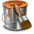
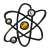

Commandes principales
#####################
   
Project
*******

|new_project| New project (Ctrl + N)
^^^^^^^^^^^^^^^^^^^^^^^^^^^^^^^^^^^^

Permet de créer un nouveau projet pyLong.

                   
|open| Open... (Ctrl + O)
^^^^^^^^^^^^^^^^^^^^^^^^^

Permet d'ouvrir un projet pyLong.

Open recents
^^^^^^^^^^^^

Permet d'ouvrir un projet pyLong récent.

|save| Save (Ctrl + S)
^^^^^^^^^^^^^^^^^^^^^^

Permet d'enregistrer le projet courant.

|save_as| Save a... (Ctrl + Shift + S)
^^^^^^^^^^^^^^^^^^^^^^^^^^^^^^^^^^^^^^

Permet d'enregistrer le projet courant à un nouvel emplacement.

                   
Quit pyLong (Ctrl + Q)
^^^^^^^^^^^^^^^^^^^^^^

Permet de quitter l'application.

Edit
****

|edit| Edit
^^^^^^^^^^^

Permet d'éditer les valeurs et/ou les paramètres de définition de l'objet sélectionné.

.. |edit| image:: ./icons/edit.png
          :scale: 50%
          
|style| Style
^^^^^^^^^^^^^

Permet d'éditer le style graphique de l'objet sélectionné.

.. |style| image:: ./icons/style.png
           :scale: 50%
           
|copy_style| Copy style (Ctrl + Alt + C)
^^^^^^^^^^^^^^^^^^^^^^^^^^^^^^^^^^^^^^^^

Permet de copier le style de l'objet sélectionné.

               
|paste_style| Paste style (Ctrl + Alt + V)
^^^^^^^^^^^^^^^^^^^^^^^^^^^^^^^^^^^^^^^^^^

Permet d'appliquer le style copié aux objets sélectionnés.

                
Export style
^^^^^^^^^^^^

Permet d'exporter le style de l'objet sélectionné.

Import style
^^^^^^^^^^^^

Permet d'importer et d'appliquer un fichier de style aux objets sélectionnés.

|export_values| Export values
^^^^^^^^^^^^^^^^^^^^^^^^^^^^^
                
Permet d'exporter les valeurs de l'objet sélectionnée vers un fichier .txt.

|duplicate| Duplicate (Ctrl + D)
^^^^^^^^^^^^^^^^^^^^^^^^^^^^^^^^

Permet de dupliquer les objets sélectionnés.

.. |duplicate| image:: ./icons/duplicate.png
               :scale: 50%

|reverse| Reverse
^^^^^^^^^^^^^^^^^

Permet de retourner les objets sélectionnés.

.. |reverse| image:: ./icons/reverse.png
             :scale: 50%
               
|delete| Delete (Suppr)
^^^^^^^^^^^^^^^^^^^^^^^

Permet de supprimer les objets sélectionnés.

.. |delete| image:: ./icons/delete.png
            :scale: 50%

Settings
********

|settings| Settings
^^^^^^^^^^^^^^^^^^^

Permet de paramétrer pyLong.

.. |settings| image:: ./icons/settings.png
              :scale: 50%

Interface
*********

|full_screen| Full screen (F11)
^^^^^^^^^^^^^^^^^^^^^^^^^^^^^^^

Permet d'activer ou désactiver le mode plein écran.

.. |full_screen| image:: ./icons/full_screen.png
                 :scale: 50%

Profiles
^^^^^^^^

Permet d'activer ou désactiver l'affichage de la liste des profils.

Annotations
^^^^^^^^^^^

Permet d'activer ou désactiver l'affichage de la liste des annotations.

Calculations
^^^^^^^^^^^^

Permet d'activer ou désactiver l'affichage de la liste des calculs.

Extra data
^^^^^^^^^^

Permet d'activer ou désactiver l'affichage de la liste des autres données.
                
|increase_canvas_size| Increase canvas size (Ctrl + +)
^^^^^^^^^^^^^^^^^^^^^^^^^^^^^^^^^^^^^^^^^^^^^^^^^^^^^^    
                
Permet d'augmenter la taille du canvas.

                        
|decrease_canvas_size| Decrease canvas size (Ctrl + -)
^^^^^^^^^^^^^^^^^^^^^^^^^^^^^^^^^^^^^^^^^^^^^^^^^^^^^^    
                
Permet de diminuer la taille du canvas.

.. |decrease_canvas_size| image:: ./icons/decrease_canvas_size.png
                          :scale: 50%
                        
|adjust_canvas_width| Adjust canvas width
^^^^^^^^^^^^^^^^^^^^^^^^^^^^^^^^^^^^^^^^^    
                
Permet d'ajuster la taille du canvas en largeur.

.. |adjust_canvas_width| image:: ./icons/adjust_canvas_width.png
                         :scale: 50%
                        
|adjust_canvas_height| Adjust canvas height
^^^^^^^^^^^^^^^^^^^^^^^^^^^^^^^^^^^^^^^^^^^   
                
Permet d'ajuster la taille du canvas en hauteur.

.. |adjust_canvas_height| image:: ./icons/adjust_canvas_height.png
                          :scale: 50%

Show message dialogs
^^^^^^^^^^^^^^^^^^^^   
                
Permet d'activer ou désactiver l'affichage des boîtes de dialogue de messages.
 
Figure
******

Add a layout
^^^^^^^^^^^^

Permet d'ajouter une mise en page.

Rename current layout
^^^^^^^^^^^^^^^^^^^^^

Permet de renommer la mise en page courante.

Delete layouts
^^^^^^^^^^^^^^

Permet de supprimer des mises en page.

|layout_properties| Layout properties
^^^^^^^^^^^^^^^^^^^^^^^^^^^^^^^^^^^^^
                
Permet de paramétrer la mise en page courante.

            
|advanced_layout_properties| Advanced layout properties
^^^^^^^^^^^^^^^^^^^^^^^^^^^^^^^^^^^^^^^^^^^^^^^^^^^^^^^
                
Permet de paramétrer la mise en page courante (mode expert).

            
|sublayouts_manager| Sublayouts manager
^^^^^^^^^^^^^^^^^^^^^^^^^^^^^^^^^^^^^^^
                
Permet de gérer les sublayouts.

.. |sublayouts_manager| image:: ./icons/sublayouts_manager.png
                        :scale: 50%
                     
|refresh| Refresh (Ctrl + R)
^^^^^^^^^^^^^^^^^^^^^^^^^^^^
                
Permet d'actualiser la figure.

.. |refresh| image:: ./icons/refresh.png
             :scale: 50%

|print_to_file| Print to file (Ctrl + P)
^^^^^^^^^^^^^^^^^^^^^^^^^^^^^^^^^^^^^^^^
                
Permet d'exporter la figure.

           
|copy_to_clipboard| Copy to clipboard (Ctrl + C)
^^^^^^^^^^^^^^^^^^^^^^^^^^^^^^^^^^^^^^^^^^^^^^^^
                
Permet de copier la figure vers le presse-papier.

Profile
*******

|import_txt_profile| Import a .txt profile
^^^^^^^^^^^^^^^^^^^^^^^^^^^^^^^^^^^^^^^^^^
                
Permet d'importer un profil en long depuis un fichier .txt.

                      
Import a .shp profile
^^^^^^^^^^^^^^^^^^^^^
                
Permet d'importer un profil en long depuis un fichier .shp.

Import a .dbf profile
^^^^^^^^^^^^^^^^^^^^^
                
Permet d'importer un profil en long depuis un fichier .dbf.

|simplify| Simplify (Visvalingam-Wyatt)
^^^^^^^^^^^^^^^^^^^^^^^^^^^^^^^^^^^^^^^
                
Permet de simplifier le profil en long avec l'algorithme de Visvalingam-Wyatt.

.. |simplify| image:: ./icons/simplify.png
              :scale: 50% 

Simplify (Ramer-Douglas-Peucker)
^^^^^^^^^^^^^^^^^^^^^^^^^^^^^^^^
                
Permet de simplifier le profil en long avec l'algorithme de Ramer-Douglas-Peucker.

|resample| Resample
^^^^^^^^^^^^^^^^^^^
                
Permet de ré-échantillonner le profil en long.

|translate| Translate
^^^^^^^^^^^^^^^^^^^^^
                
Permet de translater le profil en long.

|truncate| Truncate
^^^^^^^^^^^^^^^^^^^
                
Permet de tronquer le profil en long.

.. |truncate| image:: ./icons/truncate.png
              :scale: 50% 

|merge| Merge
^^^^^^^^^^^^^
                
Permet de fusionner deux profils en long.

|interactive_edition| Interactive edition
^^^^^^^^^^^^^^^^^^^^^^^^^^^^^^^^^^^^^^^^^
                
Permet d'activer ou désactiver le mode édition interactive.

.. |interactive_edition| image:: ./icons/interactive_edition.png
                         :scale: 50%  

|add_point| Add a point
^^^^^^^^^^^^^^^^^^^^^^^
                
Permet d'activer ou désactiver le mode ajout de point.

|delete_point| DElete a point
^^^^^^^^^^^^^^^^^^^^^^^^^^^^^
                
Permet d'activer ou désactiver le mode suppression de point.

|magnetism| Magnetism
^^^^^^^^^^^^^^^^^^^^^
                
Permet d'activer ou désactiver l'accrochage sur un profil en long.

.. |magnetism| image:: ./icons/magnetism.png
               :scale: 50%  

Annotation
==========

|text| Ajouter un texte
^^^^^^^^^^^^^^^^^^^^^^^
                
Permet d'ajouter un texte.

.. |text| image:: ./icons/text.png
          :scale: 50% 
          
|verticalAnnotation| Ajouter une annotation verticale
^^^^^^^^^^^^^^^^^^^^^^^^^^^^^^^^^^^^^^^^^^^^^^^^^^^^^
                
Permet d'ajouter une annotation verticale.

.. |verticalAnnotation| image:: ./icons/verticalAnnotation.png
                        :scale: 50% 
                        
|horizontalAnnotation| Ajouter une annotation horizontale
^^^^^^^^^^^^^^^^^^^^^^^^^^^^^^^^^^^^^^^^^^^^^^^^^^^^^^^^^
                
Permet d'ajouter une annotation horizontale.

.. |horizontalAnnotation| image:: ./icons/horizontalAnnotation.png
                          :scale: 50% 
                          
|interval| Ajouter un intervalle
^^^^^^^^^^^^^^^^^^^^^^^^^^^^^^^^
                
Permet d'ajouter un intervalle.

.. |interval| image:: ./icons/interval.png
              :scale: 50% 

|rectangle| Ajouter un rectangle
^^^^^^^^^^^^^^^^^^^^^^^^^^^^^^^^
                
Permet d'ajouter un rectangle.

.. |rectangle| image:: ./icons/rectangle.png
               :scale: 50% 
               
|polygon| Ajouter un polygone
^^^^^^^^^^^^^^^^^^^^^^^^^^^^^
                
Permet d'ajouter un polygone.

.. |polygon| image:: ./icons/polygon.png
             :scale: 50% 

|arc| Ajouter un arc
^^^^^^^^^^^^^^^^^^^^
                
Permet d'ajouter un arc d'ellipse.

.. |arc| image:: ./icons/arc.png
         :scale: 50% 
             
|adjustAnnotations| Ajuster
^^^^^^^^^^^^^^^^^^^^^^^^^^^
                
Permet d'ajuster les annotations sélectionnées.

.. |adjustAnnotations| image:: ./icons/adjustAnnotations.png
                       :scale: 50% 
             
Ajouter un groupe
^^^^^^^^^^^^^^^^^
                
Permet d'ajouter un groupe d'annotations.

Renommer le groupe
^^^^^^^^^^^^^^^^^^
                
Permet de renommer le groupe d'annotations courant.

Supprimer des groupes
^^^^^^^^^^^^^^^^^^^^^
                
Permet de supprimer des groupes d'annotations.

|groupsManager| Gestion des groupes
^^^^^^^^^^^^^^^^^^^^^^^^^^^^^^^^^^^
                
Permet de gérer les groupes d'annotations.

.. |groupsManager| image:: ./icons/groupsManager.png
                   :scale: 50% 
                   
|annotations2reminderLines| Annotations vers lignes de rappel
^^^^^^^^^^^^^^^^^^^^^^^^^^^^^^^^^^^^^^^^^^^^^^^^^^^^^^^^^^^^^
                
Permet de générer les lignes de rappel des annotations sélectionnées.

.. |annotations2reminderLines| image:: ./icons/annotations2reminderLines.png
                              :scale: 50% 
                              
|reminderLinesManager| Gestion des lignes de rappel
^^^^^^^^^^^^^^^^^^^^^^^^^^^^^^^^^^^^^^^^^^^^^^^^^^^
                
Permet de gérer les lignes de rappel.

.. |reminderLinesManager| image:: ./icons/reminderLinesManager.png
                          :scale: 50% 

Toolbox
=======

|toolbox| Boîte à outils
^^^^^^^^^^^^^^^^^^^^^^^^
                
Permet d'activer ou désactiver l'affichage de la boîte à outils.

.. |toolbox| image:: ./icons/toolbox.png
             :scale: 50% 

Autres données
==============

|extraData| Importer d'autres données
^^^^^^^^^^^^^^^^^^^^^^^^^^^^^^^^^^^^^
                
Permet d'importer d'autres données.

.. |extraData| image:: ./icons/extraData.png
               :scale: 50% 

Ressources
==========

|rtfdocs| Documentation
^^^^^^^^^^^^^^^^^^^^^^^

Permet d'accéder au site web de pyLong.

.. |rtfdocs| image:: ./icons/rtfdocs.png
             :scale: 50% 
             
|about| A propos de pyLong
^^^^^^^^^^^^^^^^^^^^^^^^^^

Permet d'afficher des informations au sujet de pyLong.

.. |about| image:: ./icons/about.png
           :scale: 50% 

|onf| ONF
^^^^^^^^^

Permet d'accéder au site web de l'ONF.

.. |onf| image:: ./icons/onf.png
         :scale: 50% 