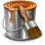
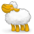
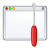
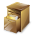
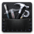

Commandes principales
*********************
   
Projet
======

|newProject| Nouveau projet (Ctrl + N)
^^^^^^^^^^^^^^^^^^^^^^^^^^^^^^^^^^^^^^

Permet de créer un nouveau projet pyLong.

                   
|openProject| Ouvrir... (Ctrl + O)
^^^^^^^^^^^^^^^^^^^^^^^^^^^^^^^^^^

Permet d'ouvrir un projet pyLong.

Projets récents
^^^^^^^^^^^^^^^

Permet d'ouvrir un projet pyLong récent.

|saveProject| Enregistrer (Ctrl + S)
^^^^^^^^^^^^^^^^^^^^^^^^^^^^^^^^^^^^

Permet d'enregistrer le projet courant.

|saveProjectAs| Enregistrer sous... (Ctrl + Shift + S)
^^^^^^^^^^^^^^^^^^^^^^^^^^^^^^^^^^^^^^^^^^^^^^^^^^^^^^

Permet d'enregistrer le projet courant à un nouvel emplacement.

                   
Quitter pyLong (Ctrl + Q)
^^^^^^^^^^^^^^^^^^^^^^^^^

Permet de quitter l'application.

Edition
=======

|edit| Editer
^^^^^^^^^^^^^

Permet d'éditer les valeurs et paramètres de définition de l'objet sélectionné.

          
|style| Style
^^^^^^^^^^^^^

Permet d'éditer le style graphique de l'objet sélectionné.

           
|copyStyle| Copier le style (Ctrl + Alt + C)
^^^^^^^^^^^^^^^^^^^^^^^^^^^^^^^^^^^^^^^^^^^^

Permet de copier le style de l'objet sélectionné.

               
|pasteStyle| Coller le style (Ctrl + Alt + V)
^^^^^^^^^^^^^^^^^^^^^^^^^^^^^^^^^^^^^^^^^^^^^

Permet d'appliquer le style copié aux objets sélectionnés.

                
Exporter le style
^^^^^^^^^^^^^^^^^

Permet d'exporter le style de l'objet sélectionné.

Importer un style
^^^^^^^^^^^^^^^^^

Permet d'importer et d'appliquer un fichier de style aux objets sélectionnés.

|export| Exporter les valeurs
^^^^^^^^^^^^^^^^^^^^^^^^^^^^^
                
Permet d'exporter les valeurs de l'objet sélectionnée vers un fichier .txt.

|duplicate| Dupliquer (Ctrl + D)
^^^^^^^^^^^^^^^^^^^^^^^^^^^^^^^^

Permet de dupliquer les objets sélectionnés.

|reverse| Retourner
^^^^^^^^^^^^^^^^^^^

Permet de retourner les objets sélectionnés.

               
|delete| Supprimer (Suppr)
^^^^^^^^^^^^^^^^^^^^^^^^^^

Permet de supprimer les objets sélectionnés.

Configuration
=============

|settings| Options
^^^^^^^^^^^^^^^^^^^

Permet de paramétrer pyLong.

Interface
=========

|fullScreen| Plein écran (F11)
^^^^^^^^^^^^^^^^^^^^^^^^^^^^^^

Permet d'activer ou désactiver le mode plein écran.

Profiles
^^^^^^^^

Permet d'activer ou désactiver l'affichage de la liste des profils.

Annotations
^^^^^^^^^^^

Permet d'activer ou désactiver l'affichage de la liste des annotations.

Calculations
^^^^^^^^^^^^

Permet d'activer ou désactiver l'affichage de la liste des calculs.

Extra data
^^^^^^^^^^

Permet d'activer ou désactiver l'affichage de la liste des âutres données.
                
|increaseCanvasSize| Augmenter la taille du canvas (Ctrl + +)
^^^^^^^^^^^^^^^^^^^^^^^^^^^^^^^^^^^^^^^^^^^^^^^^^^^^^^^^^^^^^    
                
Permet d'augmenter la taille du canvas.

.. |increaseCanvasSize| image:: ./icons/increaseCanvasSize.png
                        :scale: 50%
                        
|decreaseCanvasSize| Diminuer la taille du canvas (Ctrl + -)
^^^^^^^^^^^^^^^^^^^^^^^^^^^^^^^^^^^^^^^^^^^^^^^^^^^^^^^^^^^^    
                
Permet de diminuer la taille du canvas.

                        
|adjustCanvasWidth| Ajuster la taille du canvas en largeur
^^^^^^^^^^^^^^^^^^^^^^^^^^^^^^^^^^^^^^^^^^^^^^^^^^^^^^^^^^    
                
Permet d'ajuster la taille du canvas en largeur.

                        
|adjustCanvasHeight| Ajuster la taille du canvas en hauteur
^^^^^^^^^^^^^^^^^^^^^^^^^^^^^^^^^^^^^^^^^^^^^^^^^^^^^^^^^^^   
                
Permet d'ajuster la taille du canvas en hauteur.

Afficher les boîtes de dialogue de messages
^^^^^^^^^^^^^^^^^^^^^^^^^^^^^^^^^^^^^^^^^^^   
                
Permet d'activer ou désactiver l'affichage des boîtes de dialoge de messages.
 
Figure
======

Ajouter une mise en page
^^^^^^^^^^^^^^^^^^^^^^^^

Permet d'ajouter une mise en page.

Renommer une mise en page
^^^^^^^^^^^^^^^^^^^^^^^^^

Permet de renommer la mise en page courante.

Supprimer des mises en page
^^^^^^^^^^^^^^^^^^^^^^^^^^^

Permet de supprimer des mises en page.

|layout| Mise en page
^^^^^^^^^^^^^^^^^^^^^   
                
Permet de paramétrer la mise en page courante.

            
|advancedLayout| Mise en page (mode expert)
^^^^^^^^^^^^^^^^^^^^^^^^^^^^^^^^^^^^^^^^^^^
                
Permet de paramétrer la mise en page courante (mode expert).

.. |advancedLayout| image:: ./icons/advancedLayout.png
                    :scale: 50%
            
|subplotsManager| Gestion des subplots
^^^^^^^^^^^^^^^^^^^^^^^^^^^^^^^^^^^^^^
                
Permet de gérer les subplots.

                     
|refresh| Actualiser (Ctrl + R)
^^^^^^^^^^^^^^^^^^^^^^^^^^^^^^^
                
Permet d'actualiser la figure.

|print| Exporter (Ctrl + P)
^^^^^^^^^^^^^^^^^^^^^^^^^^^
                
Permet d'exporter la figure.

           
|copyFigure| Copier (Ctrl + C)
^^^^^^^^^^^^^^^^^^^^^^^^^^^^^^
                
Permet de copier la figure vers le presse-papier.

Profil
======

|importTxtProfile| Importer un profile .txt
^^^^^^^^^^^^^^^^^^^^^^^^^^^^^^^^^^^^^^^^^^^
                
Permet d'importer un profil en long depuis un fichier .txt.

                      
Importer un profile .shp
^^^^^^^^^^^^^^^^^^^^^^^^
                
Permet d'importer un profil en long depuis un fichier .shp.

Importer un profile .dbf
^^^^^^^^^^^^^^^^^^^^^^^^
                
Permet d'importer un profil en long depuis un fichier .dbf.

|simplify| Simplifier
^^^^^^^^^^^^^^^^^^^^^
                
Permet de simplifier le profil en long.

|interactiveEdition| Edition interactive
^^^^^^^^^^^^^^^^^^^^^^^^^^^^^^^^^^^^^^^^
                
Permet d'activer ou désactiver le mode édition interactive.

|addPoint| Ajouter un point
^^^^^^^^^^^^^^^^^^^^^^^^^^^
                
Permet d'activer ou désactiver le mode ajout de point.

|deletePoint| Supprimer un point
^^^^^^^^^^^^^^^^^^^^^^^^^^^^^^^^
                
Permet d'activer ou désactiver le mode suppression de point.

|magnetism| Accrochage
^^^^^^^^^^^^^^^^^^^^^^
                
Permet d'activer ou désactiver l'accrochage sur un profil en long.

Annotation
==========

|text| Ajouter un texte
^^^^^^^^^^^^^^^^^^^^^^^
                
Permet d'ajouter un texte.

          
|verticalAnnotation| Ajouter une annotation verticale
^^^^^^^^^^^^^^^^^^^^^^^^^^^^^^^^^^^^^^^^^^^^^^^^^^^^^
                
Permet d'ajouter une annotation verticale.

                        
|horizontalAnnotation| Ajouter une annotation horizontale
^^^^^^^^^^^^^^^^^^^^^^^^^^^^^^^^^^^^^^^^^^^^^^^^^^^^^^^^^
                
Permet d'ajouter une annotation horizontale.

                          
|interval| Ajouter un intervalle
^^^^^^^^^^^^^^^^^^^^^^^^^^^^^^^^
                
Permet d'ajouter un intervalle.

|rectangle| Ajouter un rectangle
^^^^^^^^^^^^^^^^^^^^^^^^^^^^^^^^
                
Permet d'ajouter un rectangle.

               
|polygon| Ajouter un polygone
^^^^^^^^^^^^^^^^^^^^^^^^^^^^^
                
Permet d'ajouter un polygone.

|arc| Ajouter un arc
^^^^^^^^^^^^^^^^^^^^
                
Permet d'ajouter un arc d'ellipse.

             
|adjustAnnotations| Ajuster
^^^^^^^^^^^^^^^^^^^^^^^^^^^
                
Permet d'ajuster les annotations sélectionnées.

             
Ajouter un groupe
^^^^^^^^^^^^^^^^^
                
Permet d'ajouter un groupe d'annotations.

Renommer le groupe
^^^^^^^^^^^^^^^^^^
                
Permet de renommer le groupe d'annotations courant.

Supprimer des groupes
^^^^^^^^^^^^^^^^^^^^^
                
Permet de supprimer des groupes d'annotations.

|groupsManager| Gestion des groupes
^^^^^^^^^^^^^^^^^^^^^^^^^^^^^^^^^^^
                
Permet de gérer les groupes d'annotations.

                   
|annotations2reminderLines| Annotations vers lignes de rappel
^^^^^^^^^^^^^^^^^^^^^^^^^^^^^^^^^^^^^^^^^^^^^^^^^^^^^^^^^^^^^
                
Permet de générer les lignes de rappel des annotations sélectionnées.

                              
|reminderLinesManager| Gestion des lignes de rappel
^^^^^^^^^^^^^^^^^^^^^^^^^^^^^^^^^^^^^^^^^^^^^^^^^^^
                
Permet de gérer les lignes de rappel.

Toolbox
=======

|toolbox| Boîte à outils
^^^^^^^^^^^^^^^^^^^^^^^^
                
Permet d'activer ou désactiver l'affichage de la boîte à outils.

Autres données
==============

|extraData| Importer d'autres données
^^^^^^^^^^^^^^^^^^^^^^^^^^^^^^^^^^^^^
                
Permet d'importer d'autres données.

Ressources
==========

|rtfdocs| Documentation
^^^^^^^^^^^^^^^^^^^^^^^

Permet d'accéder au site web de pyLong.

             
|about| A propos de pyLong
^^^^^^^^^^^^^^^^^^^^^^^^^^

Permet d'afficher des informations au sujet de pyLong.

|onf| ONF
^^^^^^^^^

Permet d'accéder au site web de l'ONF.

