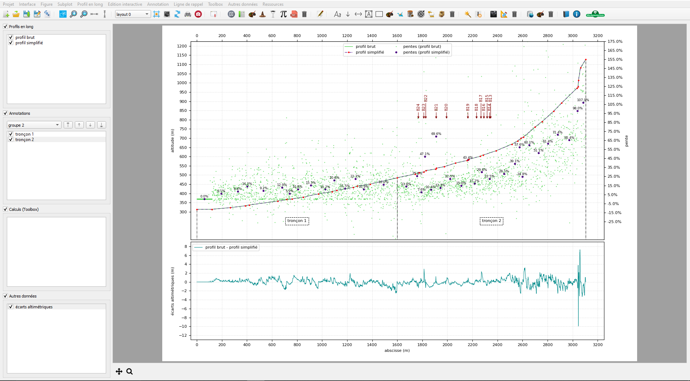
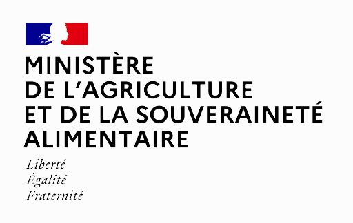

pyLong, introduction
####################

**pyLong** est un logiciel interfacé de visualisation, d'édition, de mise en page, d'analyse et de traitement de profils en long, dédié à l'hydraulique torrentielle et aux mouvements de terrain en montagne.

   
   Aperçu du logiciel pyLong.

**pyLong** est développé et maintenu par les Services de Restauration de Terrains en Montagne de  `l'Office National des Forêts <https://www.onf.fr>`_ et financé par `le Ministère de l'Agriculture et de la Souveraineté Alimentaire <https://agriculture.gouv.fr>`_.
   

|

Les principales fonctionnalités de **pyLong** sont:

- **importation** de profils aux formats *.txt*, *.shp* et *.dbf*;
- **simplification automatisée** du profil avec, au choix, l'algorithme de *Visvalingman & Wyatt* ou l'algorithme de *Ramer-Douglas-Peucker*;
- **simplification interactive** du profil avec l'ajout ou la suppression manuelle de points;
- **construction géométrique** de points sur profil;
- **outils d'édition**: ré-échantillonnage, translation, fusion, troncage du profil;
- **affichage** des pentes longitudinales, en degré ou en pourcentage;
- **ajout** d'annotations;
- **importation et exportation** de fichiers de style graphique;
- **mises en page** multiples et personnalisables;
- **toolbox** comprenant notamment des outils dédiés à l'hydraulique torrentielle et aux mouvements de terrain;
- **exportation** dans divers formats pour insertion dans des documents d'étude, rapports d'expertise et publications scientifiques.

**pyLong** a été créé pour des besoins opérationnels par des ingénieurs pour des ingénieurs. Il peut être utilisé par des bureaux d'études, des enseignants, des maîtres d'ouvrage & maîtres d'œuvre, des chercheurs, des étudiants, etc.

Afin de contribuer à sa diffusion, nous vous invitons à citer **pyLong** dans vos productions en utilisant la référence suivante:

- ONF-RTM. pyLong [Logiciel interfacé et librairie Python de visualisation, d'édition, de mise en page, d’analyse et de traitement de profils en long]. https://pylong-onf-rtm.readthedocs.io/

- ONF-RTM. pyLong [Interfaced software and Python library for viewing, editing, layout, analysis and processing of longitudinal profiles]. https://pylong-onf-rtm.readthedocs.io/