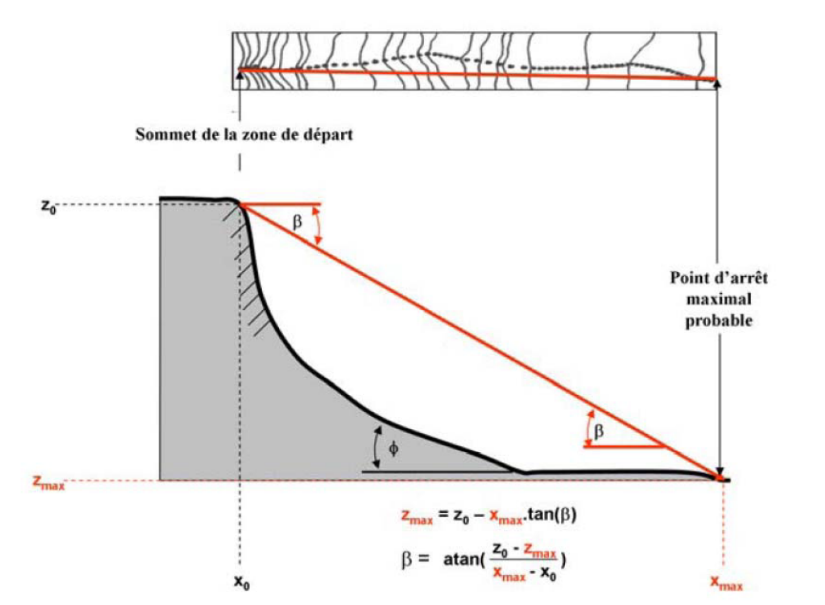
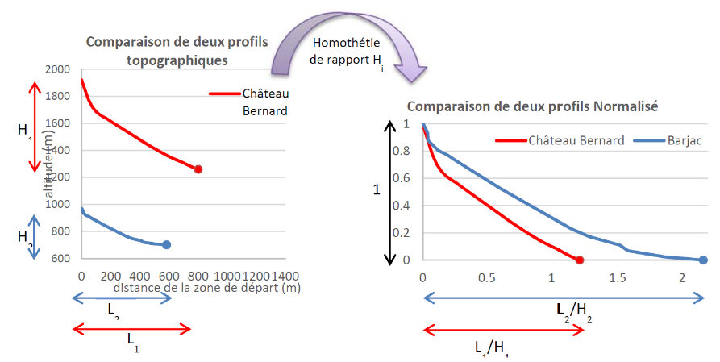
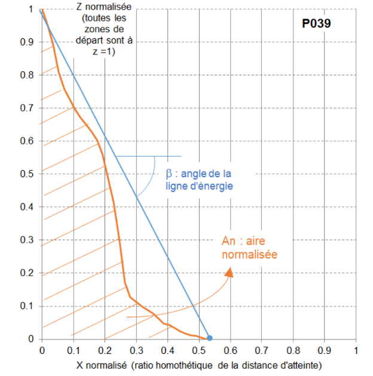
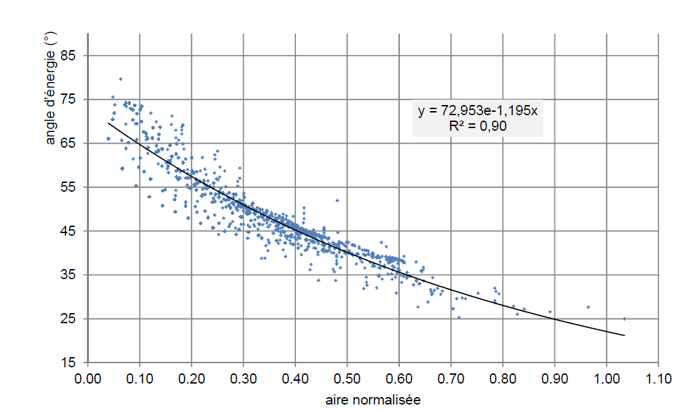
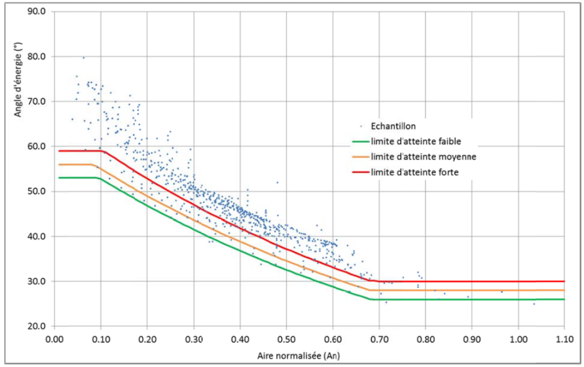
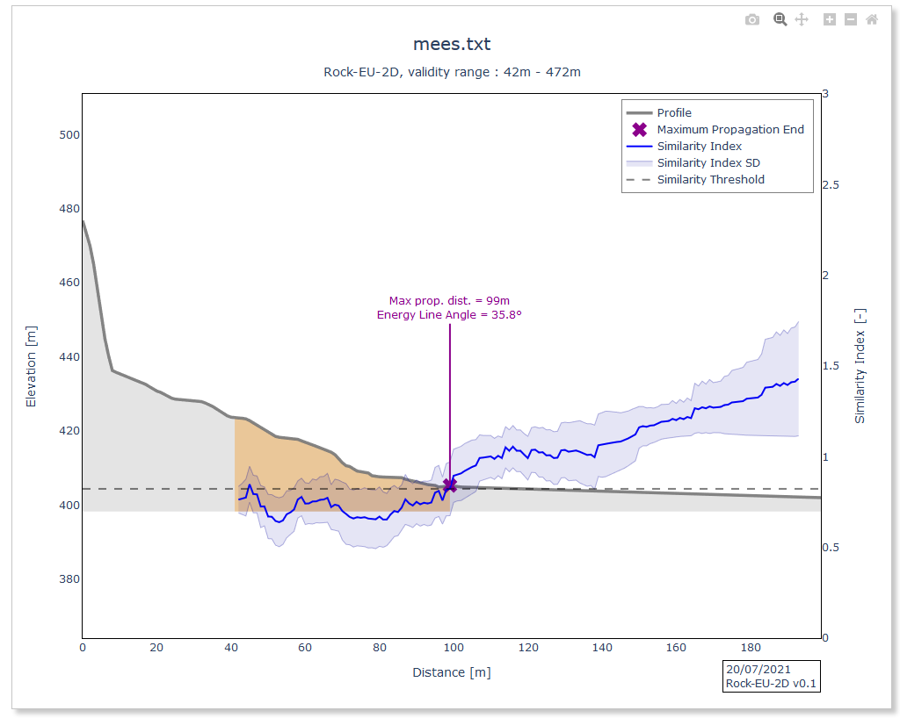
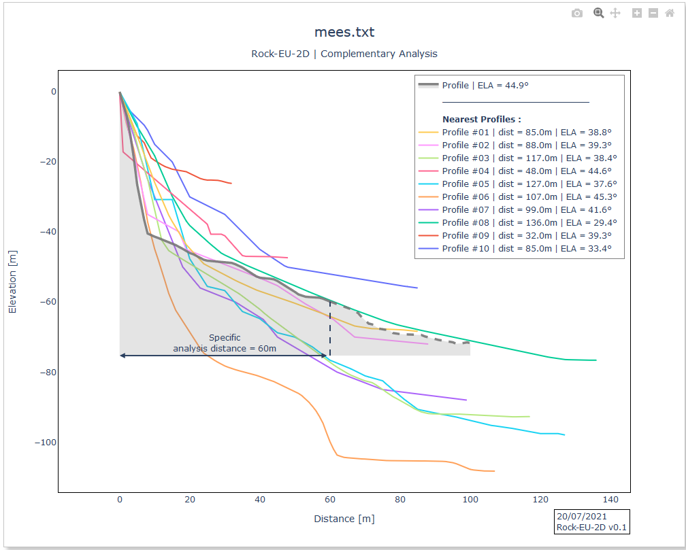

Mezap
*****

Approche statistique par l'aire normalisée de la distance de propagation des blocs selon le principe de la ligne d'énergie
==========================================================================================================================

Fondement de la méthode dite de l'aire adimensionnelle ou normalisée
^^^^^^^^^^^^^^^^^^^^^^^^^^^^^^^^^^^^^^^^^^^^^^^^^^^^^^^^^^^^^^^^^^^^

Une base de donnée événementielle
"""""""""""""""""""""""""""""""""

Différents travaux réalisés depuis plusieurs années de compilation de données (`RockTheAlps <https://www.alpine-space.eu/projects/rockthealps/en/results-and-download/download>`_, MEZAP, BRGM, RTM, …) 
ont permis la constitution d’une base de données événementielle de chutes de bloc détaillée.

L'outil utilise aujourd'hui une source de 2758 événements et sera régulièrement actualisée.

Modèle de la ligne d'énergie
""""""""""""""""""""""""""""

Le principe de la ligne d’énergie est développé par Heim A. (1932). Il s’agit d’un modèle simplifié représentant au travers de la variable aléatoire :math:`\beta` la distance de propagation d’un bloc en fonction d’un point de départ.

   Représentation schématique du principe de la ligne d’énergie et de la formule pour déterminer l’angle :math:`\beta` (Berger, 2009).

Une approche dite de l'aire normalisée ("adimensionnelle")
""""""""""""""""""""""""""""""""""""""""""""""""""""""""""

Pour proposer un modèle statistique exprimant la valeur de la variable aléatoire :math:`\beta` en fonction d’une variable explicative descriptive du versant, le BRGM et l’INRAe 
ont proposé de rendre adimensionnel les profils afin de pouvoir tous les comparer.

   
   Principe de la normalisation des profils topographiques (BRGM).

Puis pour simplifier la démarche le BRGM et l’INRAe ont choisi d’utiliser une unique variable explicative de type aire adimensionnelle:

- aire sous le profil pour le BRGM;
- aire sur le profil pour l’INRAe.

   Description de la notion d’aire normalisée et sa relation à une valeur de :math:`\beta` (BRGM).

La relation statistique entre ces 2 variables est alors représentée sur la figure suivante (cas de l’aire sous le profil) au travers des 2758 couples de valeur issus de la base de données événementielles utilisées.

   Représentation des 2758 couples de valeur et ajustement d’une loi statistique.

Il s’avère qu’une relation statistique fiable a été mise en évidence (dans le respect de l’échantillon, c’est-à-dire 2783 profils de moins de 500 m et peu représentatif des cas extrêmes où est visible sur le graphique le manque de données).
En complément, le BRGM a proposé une analyse quantitative des probabilités d’atteinte, en reprenant les seuils :math:`10^{-6}`, :math:`10^{-4}` et :math:`10^{-2}`. Ces seuils sont reconstruits sur la base des données pour des plages de valeurs d’aire normalisée et représentés ci-dessous.

   Proposition de seuils de valeurs d’angle d’énergie limites en fonction de l’aire normalisée.

.. note::
    - A savoir que la base de données aujourd’hui ne contient que des profils d’une longueur inférieure à 472 m. Pour les profils plus longs, il y a donc une absence de données de comparaison.

Préconisations d'usage de l'outil
^^^^^^^^^^^^^^^^^^^^^^^^^^^^^^^^^

L’outil permet de représenter le profil choisi en fonction de son aire normalisée et de positionner alors pour chaque point du profil le couple (:math:`A^n`; :math:`\beta`).
Il est alors possible d’apprécier au travers de ce couple pour chaque point du profil les valeurs min et max de :math:`\beta` de la base de données et d’apprécier la probabilité d’atteinte de ce point:

- au-dessus du nuage de point: c’est un point de passage; 
- dans le nuage de point: c’est un point de passage et d’arrêt;
- sous le nuage de point: c’est un point d’arrêt voir un point non atteignable.

Il est également possible de retrouver les valeurs de ligne d’énergie pour les différentes probabilités d’atteinte proposée par le BRGM (intersection du profil d’aire normalisée et des courbes seuils).

Module ROCK-EU-2D de la plateforme PlatRock
===========================================

Ce module permet d’extraire les profils de la base de données et les valeurs de la ligne d’énergie correspondantes.
Il permet aussi une comparaison plus poussée du profil avec les profils de la base de données. 
Une fonction de comparaison KNN (Wenberger and Saul 2009) est utilisée pour comparer, 7 paramètres géométriques du profil saisi, avec ceux de la base de données.
Cette analyse permet alors de définir une valeur de ligne d’énergie maximale au sens, "vulgarisé", où il n’existe plus de profils similaires dans la base de données selon ce critère.

   Application Rock-EU-2D: détermination par comparaison de 7 paramètres géométriques de la distance de propagation maximale et de la valeur :math:`\beta` entre un profil saisi et les profils de la base de données.

Pour affiner la démarche il importe de retrouver les profils issus de la base de données les plus proches de celui retenu au moyen de l’approche de l'aire normalisée. 

   Application Rock-EU-2D: recherche des 10 profils les plus proches selon 7 paramètres géométriques dans la base de données et valeurs de :math:`\beta` associées.

Compléter l'approche de mesures d'événements sur site
=====================================================

Idéalement, s’agissant d’une approche statistique, elle s’enrichit des observations réalisées sur le site d’étude qui viennent compléter l’analyse.
Ainsi il importe de vérifier où se positionne les couples (:math:`A^n`, :math:`\beta`) des blocs observés sur le site.